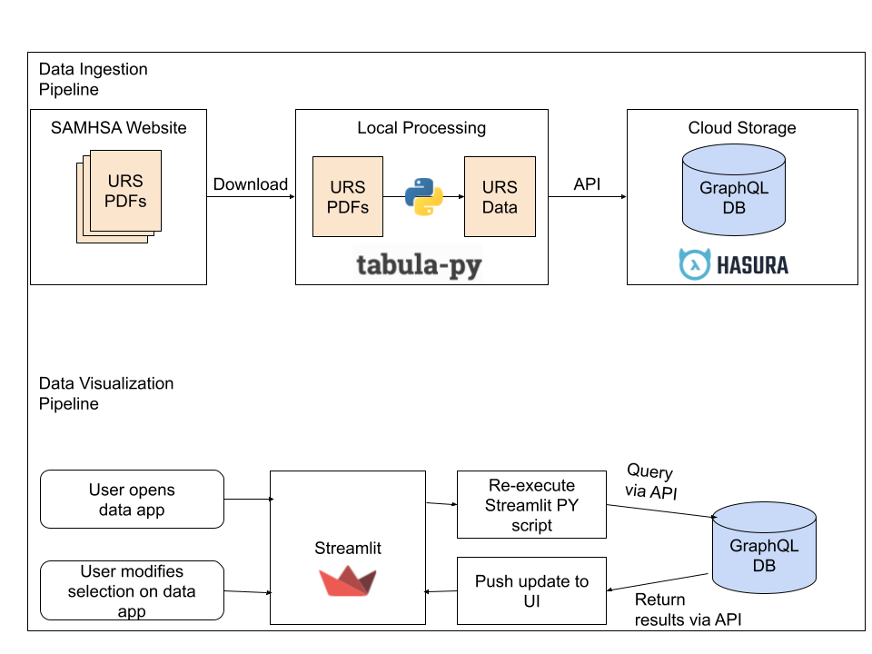

# MH URS Parsinator 
## Overview
Scripting to extract mental health-related data from [SAMHSA's URS tables](https://www.samhsa.gov/data/data-we-collect/urs-uniform-reporting-system).
## About
This project uses [Tabula-py](https://github.com/chezou/tabula-py) to parse Uniform Reporting System (URS) data stored in PDF format. Extracted data is validated using [Pydantic](https://github.com/pydantic/pydantic) and pushed into a [GraphQL API](https://cloud.hasura.io/public/graphiql?endpoint=https://mh-urs-parsinator.hasura.app/v1/graphql).

### Data Workflows

## [Explore data on Streamlit](https://mh-urs-parsinator.streamlit.app/) [In Development]
## To Do
* Instances where Total Served phrase wraps causes chaos.
* Appropriateness + outcomes tables are problematic - will circle back
* Translate some of the demographic categories so they're used consistently
* Access domain sometimes skips first row - need to adjust
* Pull GQL queries into separate files
* Create data model for metric definitions
* Add all/remove all states to Streamlit data explorer